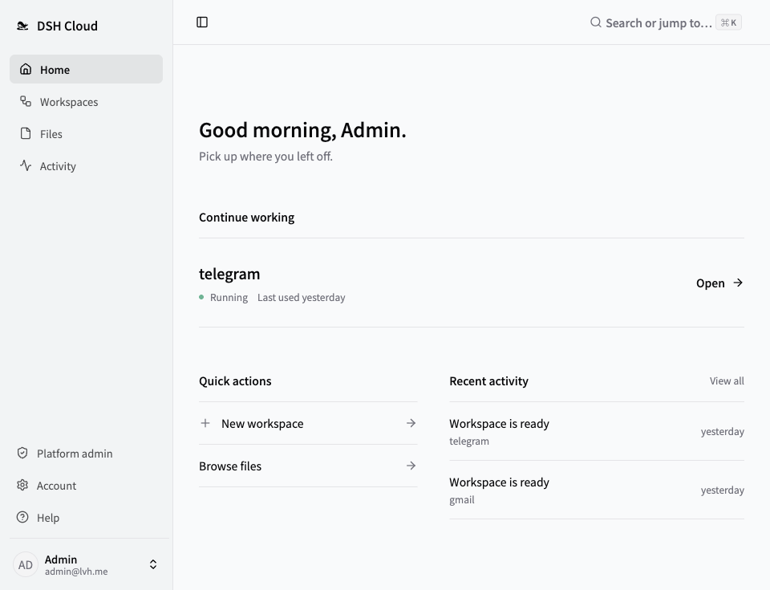
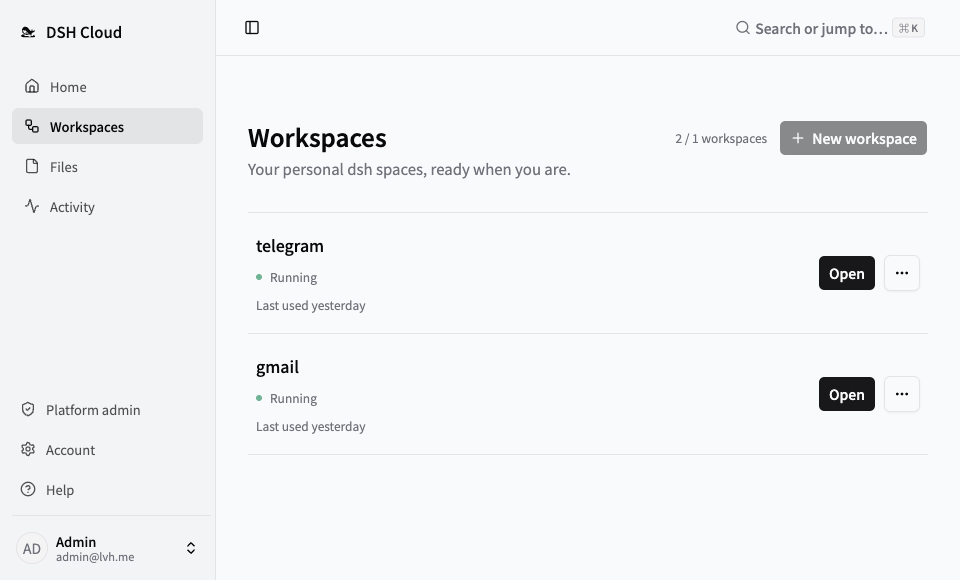
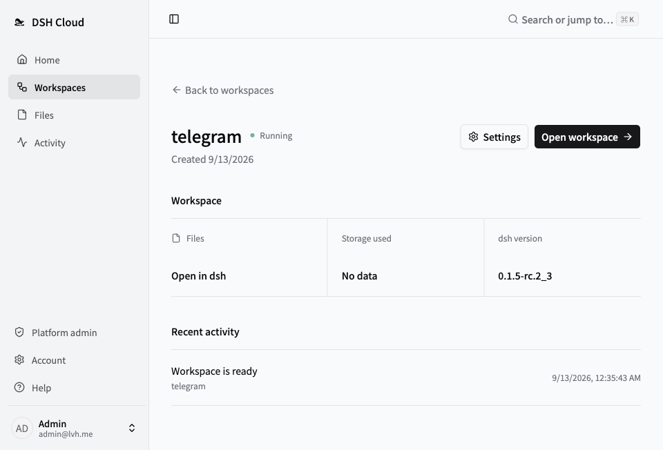
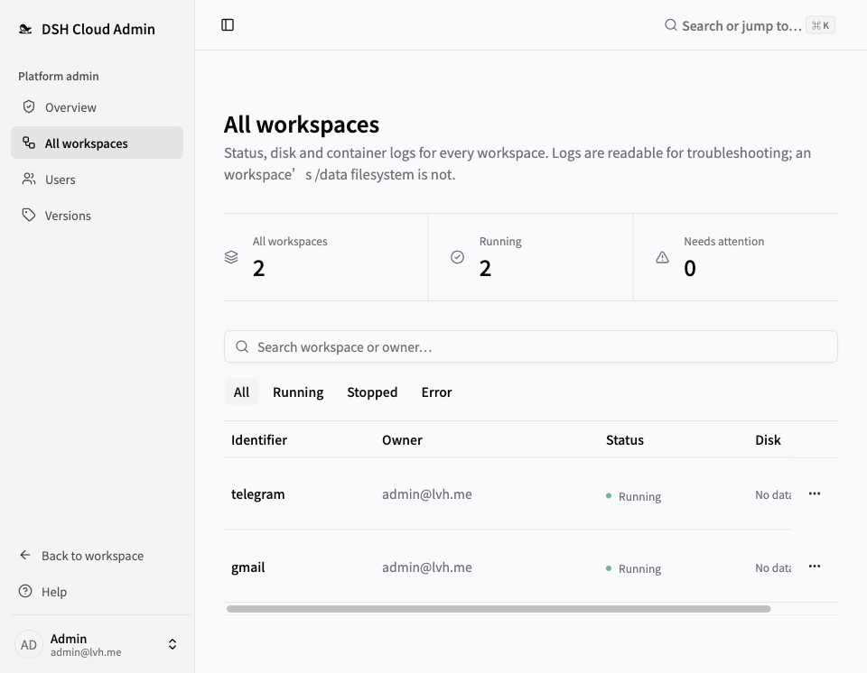
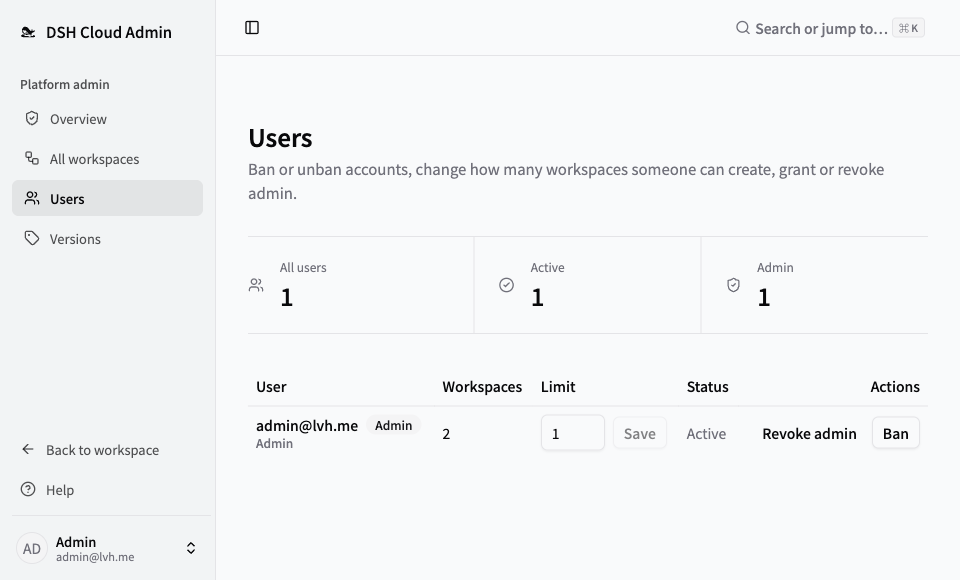

<p align="center">
  <picture>
    <source media="(prefers-reduced-motion: reduce) and (prefers-color-scheme: dark)" srcset="apps/web/public/brand/dshcloud-lockup-dark.svg">
    <source media="(prefers-reduced-motion: reduce)" srcset="apps/web/public/brand/dshcloud-lockup.svg">
    <source media="(prefers-color-scheme: dark)" srcset="docs/assets/dshcloud-swim-dark.png">
    
  </picture>
</p>

<p align="center">
  <b>A self-hosted, multi-user platform for DeepSeek Harness</b>
</p>

<p align="center">
  <a href="README.md">简体中文</a> · <b>English</b>
</p>

<p align="center">
  <a href="#features">Features</a> ·
  <a href="#getting-started">Getting Started</a> ·
  <a href="#documentation">Documentation</a> ·
  <a href="#contributing">Contributing</a>
</p>

**dshcloud** provides isolated workspaces for [DeepSeek Harness](https://github.com/deepseek-ai/deepseek-harness) (`dsh`) on infrastructure you control, with centralized authentication, resource quotas and version management. Users can access their workspaces through a browser. Workspace data is persisted independently, so files, sessions, plugins and configuration remain intact across version upgrades.

After deploying the platform, administrators can add users through invitation links. Each user can create and manage multiple workspaces within their assigned quota.

> **Early development.** Use this project for evaluation and development. It is not production-ready; deployment validation and security work remain open. See the permission boundaries and operational limits in the [architecture and security model](docs/ARCHITECTURE.md) before exposing it to the internet.

## Local dsh vs. dshcloud

| Running dsh locally | On dshcloud |
| --- | --- |
| Depends on the local device remaining available | Runs continuously on infrastructure you control |
| Access is limited by the local device | Accessible through a browser from multiple devices |
| No resource or data isolation between users | **Multi-user:** each user receives isolated workspaces |
| Multiple projects require separate installations | **Multiple workspaces:** each user can create several workspaces |
| Upgrades may require environment reconfiguration | Image-based upgrades preserve persistent data |

## Features

- **Workspaces:** create, start, stop, rebuild and delete workspaces. Each workspace has an independent container and persistent storage, with configurable limits for CPU, memory, process count and disk capacity.
- **Multi-user:** administrators add users through invitation links. Users can access and manage only their assigned workspaces.
- **Access control:** workspace ports are published only to the host loopback interface. External access requires Traefik authentication, an ownership check and per-workspace signature validation.
- **Version management:** synchronize the version catalog from GHCR, publish versions and configure the default version. Upgrades replace the image and create a rollback-capable data snapshot beforehand.
- **Console:** account status, resource quotas, usage sampling and workspace log streaming.
- **Interface:** English and Simplified Chinese, light and dark themes, ⌘K command menu.

## Screenshots

### Home

<p>
  <a href="docs/screenshots/en/home.png"></a>
</p>

### Workspaces

<p>
  <a href="docs/screenshots/en/workspaces.png"></a>
</p>

### Workspace details

<p>
  <a href="docs/screenshots/en/workspace.png"></a>
</p>

<details>
  <summary>Administration · Overview</summary>
  <p>
    <a href="docs/screenshots/en/admin.png"></a>
  </p>
</details>

<details>
  <summary>Administration · All workspaces</summary>
  <p>
    <a href="docs/screenshots/en/admin-instances.png"></a>
  </p>
</details>

<details>
  <summary>Administration · Users</summary>
  <p>
    <a href="docs/screenshots/en/admin-users.png"></a>
  </p>
</details>

## Getting Started

The local development environment uses `lvh.me`. Its public wildcard DNS entry, `*.lvh.me`, resolves to `127.0.0.1`, so no local DNS configuration is required and it does not conflict with applications such as Clash that use port `53`.

The Compose stacks in this repository target local development, not a production installation.

### Prerequisites

- Node.js 22 or later and pnpm 10.10.0, as specified in [package.json](package.json).
- Docker Desktop with Linux container support and Compose v2. The control plane connects to the Docker daemon **at startup**, rather than only when creating workspaces.
- Host ports `80` / `443` / `3000` / `5173` / `55432` free.
- **Hard disk quotas depend on the host filesystem:** workspace data is stored under `HOST_STORAGE_ROOT` (`~/dsh-data` by default with `pnpm dev`). On Linux, this path must reside on **XFS mounted with `pquota`**. If the current filesystem is not XFS, the platform creates and mounts a loopback XFS image, which requires `CAP_SYS_ADMIN`. The platform **refuses to start** if neither option is available. The macOS and Docker Desktop kernels do not provide the required quota support, so disk quotas are not enforced in development and the console reports them as "no limit." See [D18](docs/DECISIONS.md).

### Run it

From the repository root:

```bash
pnpm install
```

```bash
pnpm dev
```

Open `https://console.lvh.me` and sign in with `admin@lvh.me` / `dsh-cloud-dev`.

`pnpm dev` performs the following steps in order. If any step fails, the script terminates and reports the cause:

1. Preflight: dependencies, ports, Docker daemon.
2. Generate `apps/server/.env.local`. If the file already exists, validate it without modifying its contents. Both secrets are generated randomly and are never printed.
3. Start PostgreSQL and the ingress ([docker/compose/local.yml](docker/compose/local.yml)), then wait for the database readiness check to pass.
4. Run database migrations and create the first administrator account.
5. Start the server with automatic reloads and the console, then print the URL after the console is ready.

`Ctrl-C` stops the server and console but **leaves the ingress and PostgreSQL running** so they can be reused by subsequent development sessions. To stop these services:

```bash
pnpm dev:down
```

To reset the local development environment by dropping the database and regenerating secrets:

```bash
docker compose -f docker/compose/local.yml down -v
```

then delete `apps/server/.env.local`.

### Handle the local certificate warning

When no local certificate is configured, Traefik uses its built-in default certificate (`CN=TRAEFIK DEFAULT CERT`), which causes the browser to display a certificate warning. Select "Advanced → Proceed" to open the console. See [D26](docs/DECISIONS.md) for the rationale. To use a trusted certificate, issue one with a SAN that covers `DNS:lvh.me,DNS:*.lvh.me` and add it to the system trust store; this configuration is not included in the repository.

### Create a workspace

You land on **Home** after signing in: recently used workspaces on top, quick actions and recent activity below.

On the "Versions" page, select "Check for updates" to synchronize available versions from GHCR. Publish the required version and set it as the default if needed. Before **users can upgrade** to a version, select "Pre-warm on this host": the upgrade picker lists only versions already cached locally, as described in [D23](docs/DECISIONS.md). **Workspace creation is not subject to this restriction**; the platform automatically pulls images that are not yet cached.

Build locally only if you changed `docker/instance-image/`:

```bash
./docker/instance-image/build.sh
```

The image tag is defined by [VERSION](docker/instance-image/VERSION) and follows the format `<dsh version>_<revision>` (for example, `0.1.2-rc.1_2`). Local builds and CI use the same full image name: `ghcr.io/eskim2001/dsh-instance:<tag>`. See [D22](docs/DECISIONS.md).

After configuring a version, create a workspace on the "Workspaces" page. Once created, it can be opened directly from its details page.

> For the ingress topology, the rationale for using `lvh.me` and common issues such as Clash PAC or restarting the container after ingress configuration changes, see the [local ingress guide](docker/compose/README.md).

## Contributing

Bug reports, documentation improvements and narrowly scoped pull requests are welcome. Include reproduction steps and environment details when reporting a bug. For changes to authentication, isolation or the data model, discuss the design and security implications before implementation.

See [AGENTS.md](AGENTS.md) for the local development workflow and repository conventions. Keep tests next to the behavior they cover and run the workspace checks before submitting changes. Update both README translations when changing shared documentation. After modifying the console UI, run `node scripts/readme-shots.mjs` to regenerate screenshots and keep them consistent with the current interface.

## Documentation

The detailed guides currently contain primarily Chinese text.

| Guide | Contents |
| --- | --- |
| [Architecture](docs/ARCHITECTURE.md) | Components, isolation model, permission boundaries and operational limits |
| [Storage selection & measurements](docs/storage/README.md) | Giving a container a disk with a hard limit: the four options, measured, and how dev machines degrade |
| [Design decisions](docs/DECISIONS.md) | Technical choices and trade-offs |
| [Open questions](docs/OPEN-QUESTIONS.md) | Unresolved validation and known gaps |
| [Local ingress](docker/compose/README.md) | DNS, TLS and workspace access in development |
| [Configuration](.env.example) | Server environment template |
| [Contributor guidance](AGENTS.md) | Local development, repository layout and conventions |
| [Security policy](SECURITY.md) | Vulnerability reporting and scope |

## License

dshcloud is licensed under the [MIT License](LICENSE). [DeepSeek Harness](https://github.com/deepseek-ai/deepseek-harness) is the upstream project; its code and other dependencies remain subject to their respective licenses.