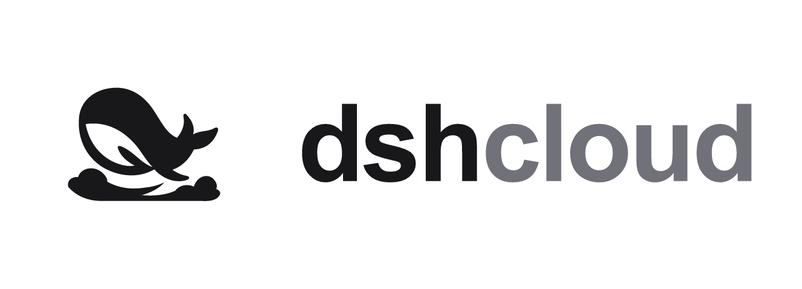
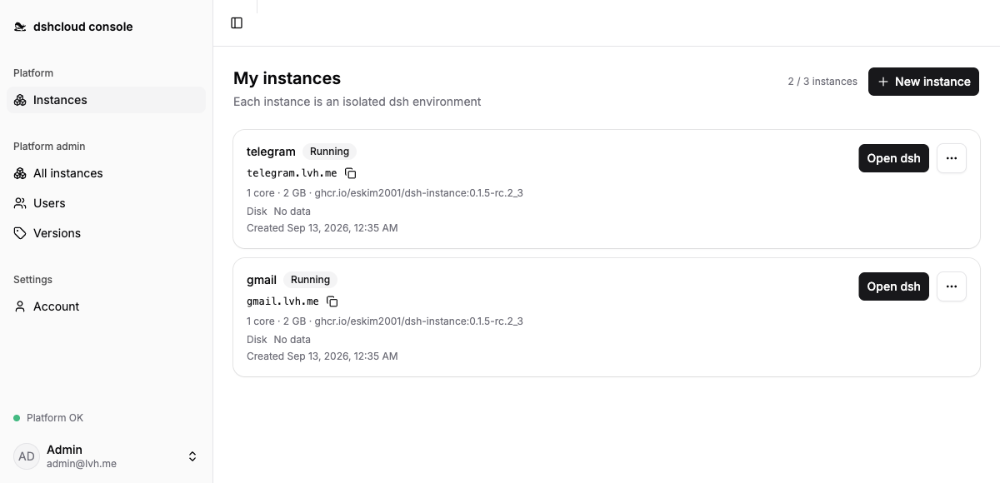
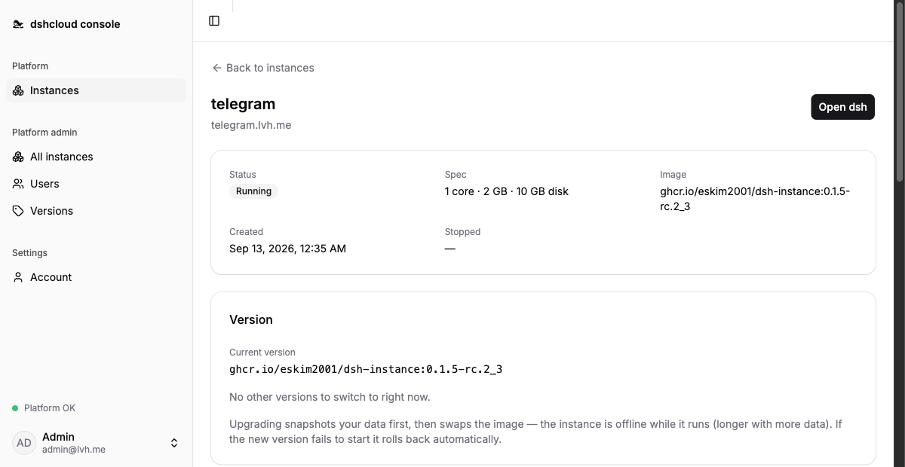
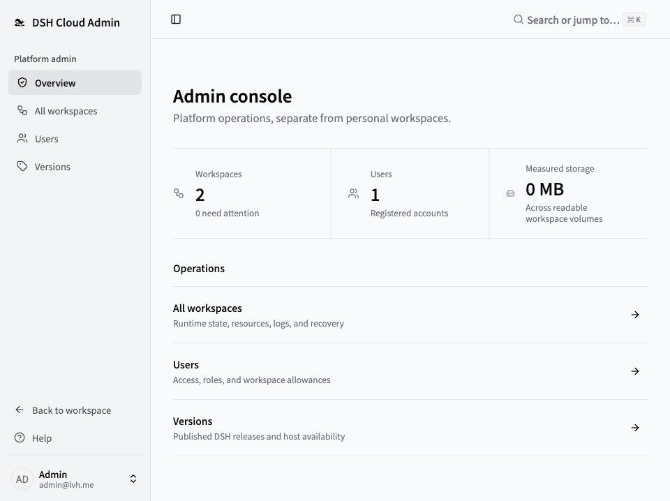
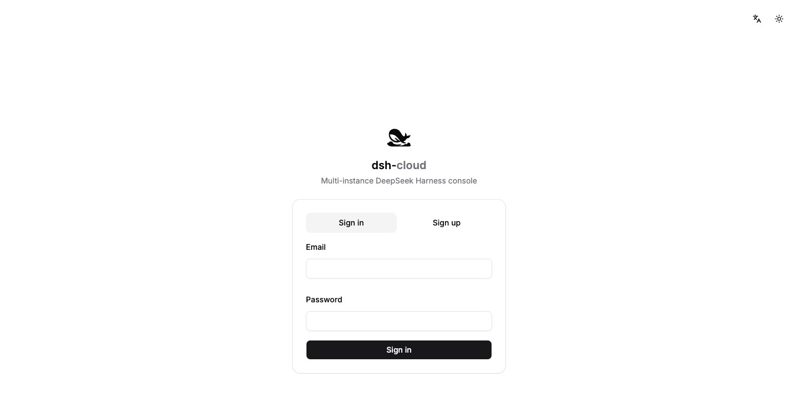

<p align="center">
  <picture>
    <source media="(prefers-reduced-motion: reduce) and (prefers-color-scheme: dark)" srcset="apps/web/public/brand/dshcloud-lockup-dark.svg">
    <source media="(prefers-reduced-motion: reduce)" srcset="apps/web/public/brand/dshcloud-lockup.svg">
    <source media="(prefers-color-scheme: dark)" srcset="docs/assets/dshcloud-swim-dark.png">
    
  </picture>
</p>

<p align="center">
  A self-hosted, multi-tenant platform for DeepSeek Harness.
</p>

<p align="center">
  <a href="README.md">简体中文</a> · <b>English</b>
</p>

<p align="center">
  <a href="#features">Features</a> ·
  <a href="#getting-started">Getting Started</a> ·
  <a href="#documentation">Documentation</a> ·
  <a href="#contributing">Contributing</a>
</p>

**dshcloud** adds account management, instance provisioning and access control to [DeepSeek Harness](https://github.com/deepseek-ai/deepseek-harness) (`dsh`). Each instance runs in its own Docker container, with a dedicated network, persistent data filesystem and resource limits. Users access their instances through an authenticated subdomain; operators manage accounts, capacity and instance versions from a web console.

> **Early development.** Use this project for evaluation and development. It is not production-ready; deployment validation and security work remain open. See [Security and Limitations](#security-and-limitations) before exposing it to the internet.

## Features

- **Instance management:** Create, start, stop, rebuild and delete instances. Per-user instance-count limits allow multiple instances within an assigned quota.
- **Resource controls:** CPU, memory and process limits, plus a hard capacity limit on each instance's `/data` filesystem. Administrators can adjust resource quotas after creation.
- **Authenticated access:** Per-instance subdomains behind Traefik, owner authorization and an instance-specific HMAC-derived gate token. Instance containers publish no host ports.
- **Persistent workspaces:** Workspace, configuration and installed user packages are directed to `/data`, which survives container rebuilds and image changes. Image changes take a pre-upgrade snapshot for rollback.
- **Operations:** Account bans, quota management, image selection, Docker-backed status, usage sampling and container log streaming. See the role boundaries below.
- **Bilingual console:** English and Simplified Chinese, light and dark themes, email/password sign-in and session management.

## Screenshots

### Instance list

<p>
  <a href="docs/screenshots/en/instances.png"></a>
</p>

### Instance details

<p>
  <a href="docs/screenshots/en/instance.png"></a>
</p>

<details>
  <summary>Administration console</summary>
  <p>
    <a href="docs/screenshots/en/admin.png"></a>
  </p>
</details>

<details>
  <summary>Sign-in page</summary>
  <p>
    <a href="docs/screenshots/en/login.png"></a>
  </p>
</details>

## Getting Started

The instructions below start the **local development console**. Opening a `dsh` instance additionally requires the ingress setup described afterwards. The included Compose stack provides local DNS and Traefik, not a complete production installation.

### Prerequisites

- Node.js 22 or later and pnpm 10.10.0, as specified in [package.json](package.json).
- A running PostgreSQL database reachable through `DATABASE_URL`.
- Docker with Linux containers and a daemon socket accessible to the server. A custom socket can be set with `DOCKER_SOCKET`; see the [Docker client](apps/server/src/docker/client.ts).
- For instance storage, a Docker host with loop devices, ext4 and the host utilities used by the [storage helper](apps/server/src/instance/host-storage.ts). Storage operations require short-lived privileged helper containers. On Docker Desktop, this host is its Linux VM, not macOS.

### 1. Install dependencies

Run from the repository root:

```bash
pnpm install
cp .env.example apps/server/.env.local
```

### 2. Configure the server

Edit the server environment file created in the previous step:

- Set `DATABASE_URL` to your database connection string. The example expects PostgreSQL on `127.0.0.1:55432`; it does not start a database.
- Set `PLATFORM_SECRET` and `BETTER_AUTH_SECRET` to **separately generated** values, each at least 32 characters long. Run the following command once for each secret and keep the values private:

```bash
openssl rand -hex 32
```

For the HTTP-only local console, set:

```dotenv
BASE_DOMAIN=localhost
PUBLIC_SCHEME=http
EXTRA_TRUSTED_ORIGINS=http://localhost:5173
TRAEFIK_ROUTES_PATH=./traefik-dynamic/routes.yml
```

The origin setting allows the Vite console to authenticate. The route path is relative to the server package when started with the command below: it writes to the directory mounted by [the local Compose stack](docker/compose/local.yml), instead of the default system path. The server creates this directory when syncing routes.

See [.env.example](.env.example) for the complete configuration template and [env.ts](apps/server/src/env.ts) for validation rules and defaults.

### 3. Apply database migrations

```bash
pnpm --filter @dsh-cloud/server db:migrate
```

### 4. Build the instance image

```bash
docker build -f docker/instance-image/Dockerfile -t dsh-instance:0.1.0 docker/instance-image/
```

The tag matches `INSTANCE_IMAGE` in the configuration template. The upstream `dsh` version is selected separately by `DSH_VERSION` in the [Dockerfile](docker/instance-image/Dockerfile).

### 5. Start the console

Start the server and frontend in separate terminals, both from the repository root:

```bash
pnpm --dir apps/server dev:local
```

```bash
pnpm dev:web
```

Open `http://localhost:5173` and register an account. To make that account a platform administrator, add its email to `ADMIN_EMAILS` in the server environment file and restart the server. This setting promotes existing accounts at startup; removing an email does not revoke its role.

The `dev:local` script explicitly loads the environment file. The root `dev:server` script does not, so it requires the variables to already be set in the process environment.

### 6. Enable instance access

Before creating and opening instances, follow the [local ingress guide](docker/compose/README.md) for DNS, trusted local TLS certificates and Traefik. That guide currently targets macOS with Docker Desktop.

Keep the writable `TRAEFIK_ROUTES_PATH` from step 2 and apply the guide's HTTPS/domain and forward-auth settings. Once the certificates and DNS are configured, start the ingress stack:

```bash
docker compose -f docker/compose/local.yml up -d
```

Restart the server and sign in at `https://app.dsh.test/`, not the localhost URL. This gives the session cookie the domain scope needed for instance subdomains. If you created instances under a different `BASE_DOMAIN`, rebuild them as described in the guide.

## Architecture

```text
Browser
  |
  v
Traefik (TLS and routing)
  |-- Base domain ------> Web console / Fastify control plane
  |                                         |-- PostgreSQL
  |                                         |-- Docker API
  |
  `-- Instance subdomain -> Forward-auth (session + owner)
                          -> Per-instance network
                          -> Caddy gate -> dsh
                                             `-- /data
```

The control plane provisions containers, storage and routes. Traefik joins each instance's dedicated bridge network and reaches the instance without a published host port. After owner authorization, it forwards an instance-specific token that the in-container gate checks.

The backend uses Fastify, Drizzle and dockerode; the console uses Vite, React and shadcn/ui. Runtime specifications and the Docker renderer live in [packages/instance-spec](packages/instance-spec). See the [architecture document](docs/ARCHITECTURE.md) for the full design.

## Security and Limitations

**Treat every instance container as an untrusted code execution environment.** Running shell commands, installing dependencies and writing files inside an instance are expected behavior, not a security exception.

### Access and data boundaries

- **Instance owners** access their own `dsh`, workspace, usage metrics and logs. Being signed in is not enough to open someone else's instance.
- **Platform administrators** manage users, quotas and image versions, and can inspect instance status and container logs. The platform provides no administrator interface for reading or browsing users' `/data` content, and the instance ingress has no administrator bypass.
- **Usage visibility in the current implementation:** Live CPU/memory/disk usage and metric history are owner-only endpoints. The administrator console currently exposes resource allocations, not other users' live usage metrics; do not confuse quota with usage.
- **Logs are not private file storage:** Container output may contain user content or secrets. Administrator log access does not imply that logs are free of sensitive data.
- **Host access is a separate trust boundary:** A host or Docker operator can access underlying storage. Application-level restrictions are not encryption against the host operator. Keep platform secrets, database credentials and the Docker socket out of instance containers.
- **Session isolation:** The trusted ingress removes platform cookies after authorization while preserving instance cookies. Control-plane writes require an exact trusted `Origin`; the authentication plugin's native account-administration endpoints are disabled.

### Operational limits

- Containers run as non-root, drop Linux capabilities and use `no-new-privileges`, but still share the host kernel. This is not VM-level isolation. Outbound network access is currently unrestricted.
- The disk quota limits the `/data` filesystem, not all host storage. Container writable layers, logs and upgrade snapshots require separate host capacity planning.
- Image changes require downtime. Rollback restores both the previous image and its pre-upgrade data snapshot, discarding subsequent data changes. Only one pre-upgrade snapshot is retained per instance; it is not an independent backup.
- Deleting without purging retains data and its ownership record. Reusing the subdomain creates a separate filesystem; recovering retained data requires operator verification, not automatic adoption by name.
- Public deployment checks remain open, including network isolation and TLS/DNS configuration on the target host. See [open questions](docs/OPEN-QUESTIONS.md). The local stack and development credentials must not be treated as a hardened public deployment.
- Billing, independent backups, a full observability stack and multi-node runtimes are not included in the current implementation. Existing status reconciliation and usage sampling are not a substitute for these capabilities.

Report vulnerabilities according to [SECURITY.md](SECURITY.md). Do not disclose security issues in public issues.

## Development

Run the workspace checks from the repository root:

```bash
pnpm typecheck
pnpm test
```

Optional integration checks exercise Docker and host storage. Use a disposable development environment and review the scripts before running them:

```bash
pnpm --filter @dsh-cloud/server check:storage
pnpm --filter @dsh-cloud/server spike
```

Their implementations are [check-storage.ts](apps/server/scripts/check-storage.ts) and [spike-instance.ts](apps/server/scripts/spike-instance.ts). These scripts use the calling process environment; unlike `dev:local`, they do not explicitly load the server environment file.

Security integration tests create and clean up temporary PostgreSQL and Traefik containers without connecting to the application database. Docker and the local images `postgres:16-alpine` and `traefik:v3.5` are required:

```bash
pnpm --filter @dsh-cloud/server test:security
```

Existing installations must follow the [security migration notes](docs/SECURITY-HARDENING.md) before starting the updated server. The migration preserves existing storage paths; it does not move or erase instance data.

## Contributing

Bug reports, documentation improvements and focused pull requests are welcome. Include reproduction steps and your environment when reporting a bug. For changes to authentication, isolation or the data model, discuss the design and security implications before implementation.

Read [AGENTS.md](AGENTS.md) for repository conventions and development commands. Keep tests close to the behavior they cover, run the workspace checks, and update both README translations when changing shared documentation.

## Documentation

The detailed guides currently contain primarily Chinese text.

| Guide | Contents |
| --- | --- |
| [Architecture](docs/ARCHITECTURE.md) | Components, access control and isolation model |
| [Design decisions](docs/DECISIONS.md) | Technical choices and trade-offs |
| [Open questions](docs/OPEN-QUESTIONS.md) | Unresolved validation and known gaps |
| [Local ingress](docker/compose/README.md) | DNS, TLS and instance access in development |
| [Configuration](.env.example) | Server environment template |
| [Contributor guidance](AGENTS.md) | Repository layout, conventions and checks |
| [Security policy](SECURITY.md) | Vulnerability reporting and scope |

## License

dshcloud is licensed under the [MIT License](LICENSE). [DeepSeek Harness](https://github.com/deepseek-ai/deepseek-harness) is the upstream project; its code and other dependencies remain subject to their respective licenses.