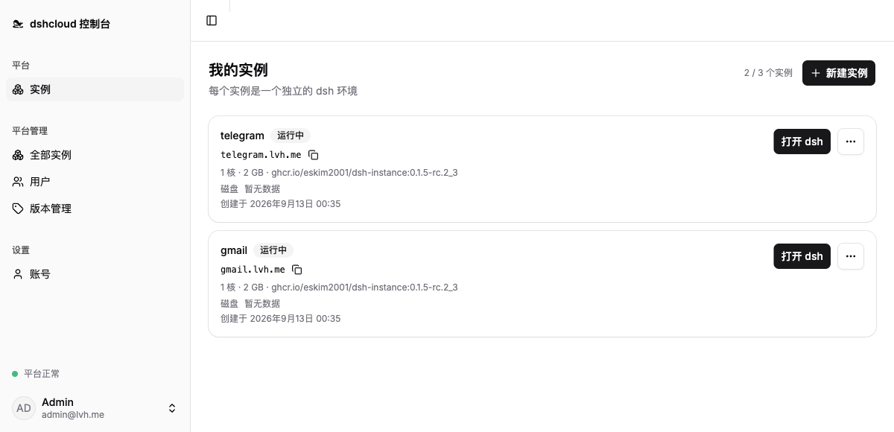
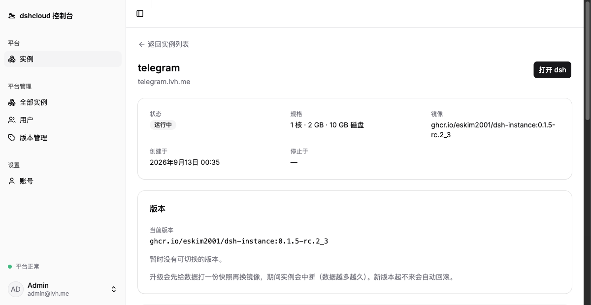
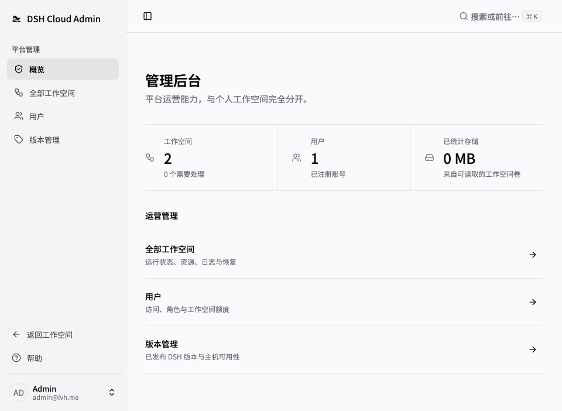
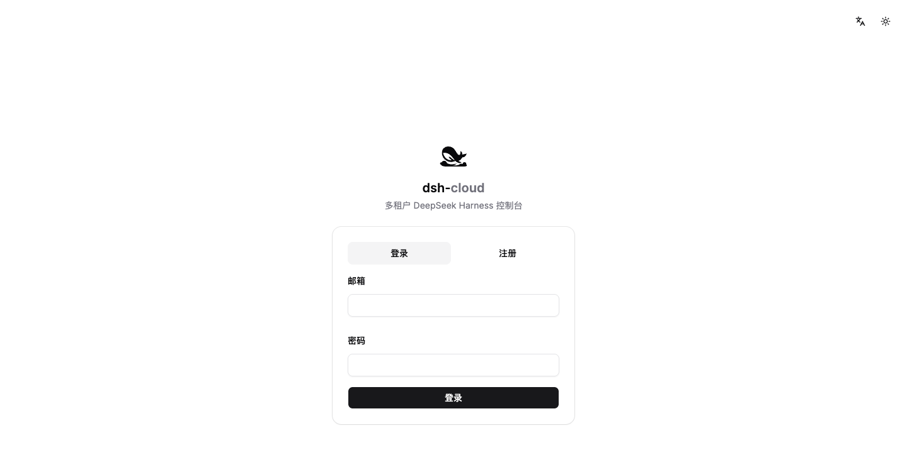

<p align="center">
  <picture>
    <source media="(prefers-reduced-motion: reduce) and (prefers-color-scheme: dark)" srcset="apps/web/public/brand/dshcloud-lockup-dark.svg">
    <source media="(prefers-reduced-motion: reduce)" srcset="apps/web/public/brand/dshcloud-lockup.svg">
    <source media="(prefers-color-scheme: dark)" srcset="docs/assets/dshcloud-swim-dark.png">
    
  </picture>
</p>

<p align="center">
  <b>DSH as a Service</b> —— 面向 DeepSeek Harness 的多租户托管平台。<br>
  <sub>DSH as a Service: a self-hosted or cloud-hosted, multi-tenant platform for deploying and hosting DeepSeek Harness (dsh) instances.</sub>
</p>

<p align="center">
  <b>简体中文</b> · <a href="README.en.md">English</a>
</p>

<p align="center">
  <a href="#功能">功能</a> ·
  <a href="#快速开始">快速开始</a> ·
  <a href="#文档">文档</a> ·
  <a href="#参与贡献">参与贡献</a>
</p>

**dshcloud** 为 [DeepSeek Harness](https://github.com/deepseek-ai/deepseek-harness)（`dsh`）提供账号管理、实例创建和访问控制。每个实例跑在独立的 Docker 容器里，拥有专属网络、持久化数据卷和资源限制。用户通过经过认证的子域访问自己的实例，运营者通过 Web 管理台管理账号、资源容量和实例版本。

> **项目处于早期开发阶段。** 当前适合评估与开发，尚不具备生产可用性；部署验证和安全工作仍有未决项。暴露到公网前，请先阅读[架构与安全模型](docs/ARCHITECTURE.md)里的权限边界与运行限制。

## 功能

- **实例管理：** 创建、启动、停止、重建和删除实例。通过每用户实例数上限，允许用户在分配的额度内拥有多个实例。
- **资源控制：** CPU、内存、进程数限制，以及每实例 `/data` 文件系统的容量硬限制。管理员可以在创建后调整资源配额。
- **认证访问：** Traefik 后的实例独立子域、所有者授权，以及通过 HMAC 派生的实例专属入口令牌。实例只在宿主回环上发布端口，不对公网暴露。
- **持久化工作区：** 工作区、配置和用户安装的软件包均指向 `/data`（一块独立的 ext4 数据卷），在实例重建与镜像切换时保留。镜像切换前创建快照，供回滚使用。
- **运维管理：** 账号封禁、配额管理、版本上架、基于运行时的状态查询、用量采样和实例日志流。各角色的权限边界见下文。
- **双语管理台：** 英文与简体中文、明暗主题、邮箱密码登录和会话管理。

## 截图

### 实例列表

<p>
  <a href="docs/screenshots/zh-CN/instances.png"></a>
</p>

### 实例详情

<p>
  <a href="docs/screenshots/zh-CN/instance.png"></a>
</p>

<details>
  <summary>平台管理台</summary>
  <p>
    <a href="docs/screenshots/zh-CN/admin.png"></a>
  </p>
</details>

<details>
  <summary>登录页</summary>
  <p>
    <a href="docs/screenshots/zh-CN/login.png"></a>
  </p>
</details>

## 快速开始

本地用 `lvh.me`：`*.lvh.me` 是公共通配 DNS，全网解析到 `127.0.0.1`，所以不需要任何 DNS 配置，也不会和 Clash 之类占用 `:53` 的程序撞车。

仓库内的 Compose 栈只面向本地开发，不是生产安装方案。

### 前置条件

- Node.js 22 或更新版本，以及 pnpm 10.10.0，版本要求见 [package.json](package.json)。
- 装了 Docker Desktop（能跑 Linux 容器，且带 Compose v2）。控制面**启动时**就要连它的 daemon，不是只在建实例时才用。
- 宿主端口 `80` / `443` / `3000` / `5173` / `55432` 空闲。
- 实例以 Docker 容器运行，数据在持久化数据卷里，实例重建不丢。

### 起

在仓库根目录：

```bash
pnpm install
```

```bash
pnpm dev
```

打开 `https://console.lvh.me`，用 `admin@lvh.me` / `dsh-cloud-dev` 登录。

`pnpm dev` 按顺序做这些事，任何一步失败都会停下来说清原因：

1. 预检依赖、端口、Docker daemon。
2. 生成 `apps/server/.env.local`（已存在则只校验，一个字节都不改）——两个 secret 随机生成、不打印。
3. 起 Postgres 和入口（[docker/compose/local.yml](docker/compose/local.yml)），等 Postgres 真的能连。
4. 跑迁移，建第一个管理员。
5. 起控制面（改代码自动重启）和管理台，等管理台起来了才打印地址。

Ctrl-C 只停控制面和管理台，**入口和 Postgres 留着**——下次 `pnpm dev` 秒起。要停它们：

```bash
pnpm dev:down
```

想从零重来（清空数据库、重新生成 secret）：

```bash
docker compose -f docker/compose/local.yml down -v
```

再删掉 `apps/server/.env.local` 即可。

### 浏览器报证书错误是正常的

Traefik 没配证书，回落到它内置的默认自签证书（`CN=TRAEFIK DEFAULT CERT`），所以会红锁——点「高级 → 继续访问」。理由见 [D26](docs/DECISIONS.md)。想要绿锁就自己签一张 SAN 覆盖 `DNS:lvh.me,DNS:*.lvh.me` 的证书装进系统信任库；仓库默认不含这一步。

### 建一个实例

在「镜像管理」页点「同步」，把 GHCR 上的版本拉进目录，再对某个版本「下载」→「发布」→「设为默认」；新建实例时会自动拉取缺的镜像。见 [D23](docs/DECISIONS.md)。

只有改了 `docker/instance-image/` 才需要本地构建：

```bash
./docker/instance-image/build.sh
```

tag 由 [VERSION](docker/instance-image/VERSION) 决定，格式是 `<dsh版本>_<修订号>`（如 `0.1.2-rc.1_2`），本地和 CI 打的是同一个全名 `ghcr.io/eskim2001/dsh-instance:<tag>`。见 [D22](docs/DECISIONS.md)。

然后在「实例」页新建一个，点开它就在浏览器里跑起来了。

> 入口栈的拓扑、为什么是 `lvh.me`、以及会踩的坑（Clash PAC、改入口配置要重启容器）见[本地入口指南](docker/compose/README.md)。

## 参与贡献

欢迎提交问题报告、文档改进和聚焦单一问题的 pull request。报告缺陷时请附上复现步骤和环境信息。涉及认证、隔离或数据模型的改动，请在实现前讨论设计与安全影响。

本地开发和仓库约定见 [AGENTS.md](AGENTS.md)。测试应紧邻其覆盖的行为，提交前运行工作区检查；修改共用 README 内容时，请同步更新中英文两版。

## 文档

详细指南目前主要使用中文。

| 指南 | 内容 |
| --- | --- |
| [架构](docs/ARCHITECTURE.md) | 组件、隔离模型、权限边界与运行限制 |
| [设计决策](docs/DECISIONS.md) | 技术选择与取舍 |
| [待验证问题](docs/OPEN-QUESTIONS.md) | 未决验证与已知缺口 |
| [本地入口](docker/compose/README.md) | 开发环境中的 DNS、TLS 与实例访问 |
| [配置](.env.example) | 控制面环境变量模板 |
| [贡献者指南](AGENTS.md) | 本地开发、仓库结构与约定 |
| [安全策略](SECURITY.md) | 漏洞报告方式与范围 |

## 许可

dshcloud 使用 [MIT 许可证](LICENSE)。[DeepSeek Harness](https://github.com/deepseek-ai/deepseek-harness) 为上游项目，其代码及其他依赖分别遵循各自的许可证。