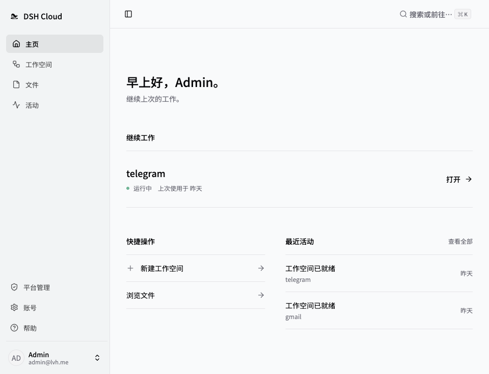
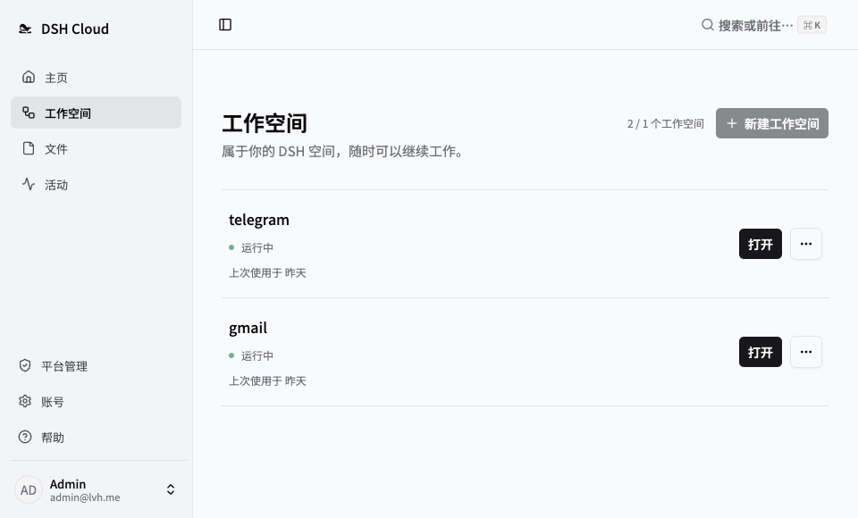
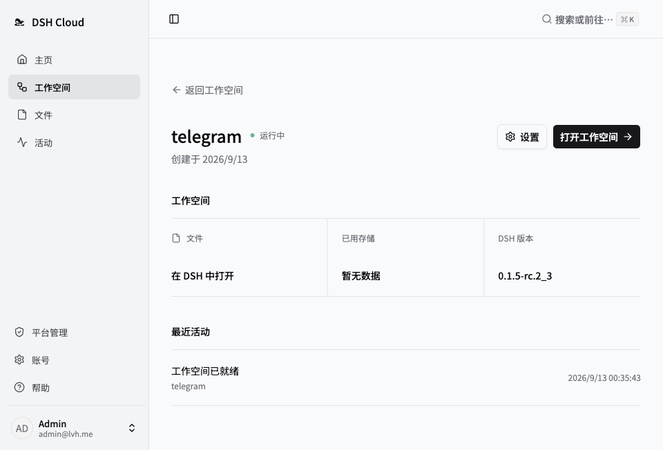
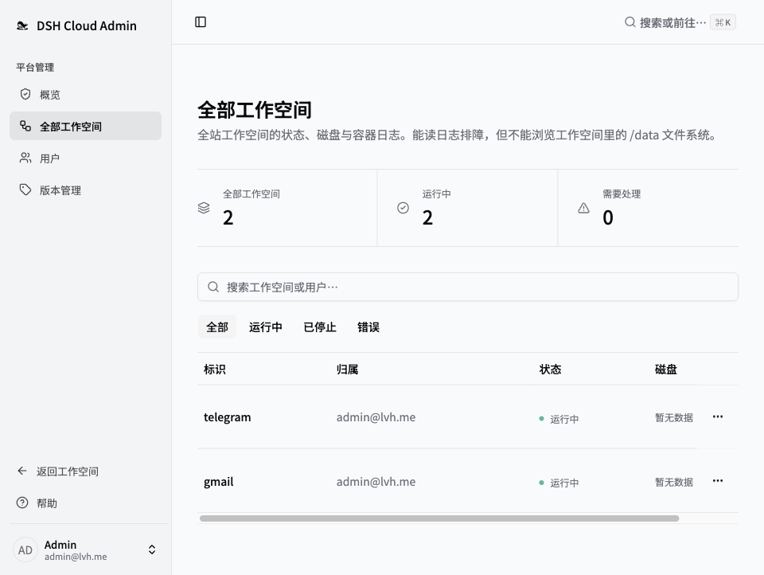
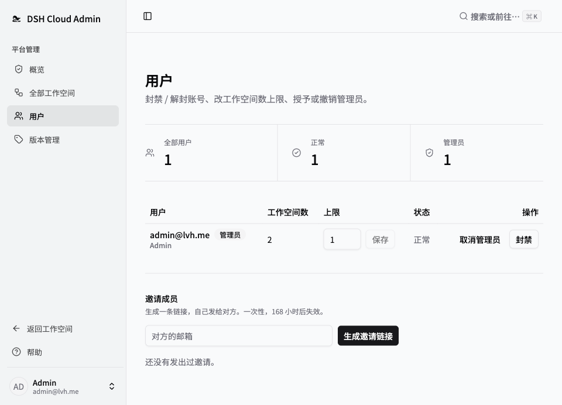

<p align="center">
  <picture>
    <source media="(prefers-reduced-motion: reduce) and (prefers-color-scheme: dark)" srcset="apps/web/public/brand/dshcloud-lockup-dark.svg">
    <source media="(prefers-reduced-motion: reduce)" srcset="apps/web/public/brand/dshcloud-lockup.svg">
    <source media="(prefers-color-scheme: dark)" srcset="docs/assets/dshcloud-swim-dark.png">
    
  </picture>
</p>

<p align="center">
  <b>DeepSeek Harness 的自托管多用户运行平台</b><br>
  <sub>A self-hosted, multi-user platform for DeepSeek Harness.</sub>
</p>

<p align="center">
  <b>简体中文</b> · <a href="README.en.md">English</a>
</p>

<p align="center">
  <a href="#功能">功能</a> ·
  <a href="#快速开始">快速开始</a> ·
  <a href="#文档">文档</a> ·
  <a href="#参与贡献">参与贡献</a>
</p>

**dshcloud** 在自有基础设施上为 [DeepSeek Harness](https://github.com/deepseek-ai/deepseek-harness)（`dsh`）提供相互隔离的工作空间，并统一管理身份认证、资源配额和运行版本。用户可通过浏览器访问工作空间；工作空间数据独立持久化，升级运行版本时，文件、会话、插件和配置均保持不变。

管理员完成平台部署后，可通过邀请链接添加用户。每位用户均可在授权配额内创建和管理多个工作空间。

> **项目处于早期开发阶段。** 当前适合评估与开发，尚不具备生产可用性；部署验证和安全工作仍有未决项。部署至公网前，请先阅读[架构与安全模型](docs/ARCHITECTURE.md)中的权限边界与运行限制。

## 与本地运行的区别

| 本地运行 dsh | 使用 dshcloud |
| --- | --- |
| 依赖本地设备持续运行 | 在自有服务器上持续运行 |
| 访问范围受本地设备限制 | 可通过浏览器从多个设备访问 |
| 缺少用户间的资源与数据隔离 | **多用户：** 为每位用户提供独立工作空间 |
| 多项目需要维护多套安装 | **多工作空间：** 支持单个用户创建多个工作空间 |
| 升级可能需要重新配置环境 | 通过镜像升级，并保留持久化数据 |

## 功能

- **工作空间：** 支持创建、启动、停止、重建和删除。每个工作空间拥有独立容器与持久化存储，并可分别设置 CPU、内存、进程数和磁盘容量限制。
- **多用户：** 管理员通过邀请链接添加用户。用户仅可访问和管理其所属工作空间。
- **访问控制：** 工作空间端口仅发布至宿主回环地址；外部访问须通过 Traefik 前置认证、所有者校验和工作空间级签名验证。
- **版本管理：** 从 GHCR 同步版本目录，支持版本发布和默认版本设置。升级通过替换镜像完成，并在升级前自动创建可用于回滚的数据快照。
- **管理台：** 账号状态、资源配额、用量采样、工作空间日志流。
- **界面：** 英文与简体中文、明暗主题、⌘K 命令面板。

## 截图

### 主页

<p>
  <a href="docs/screenshots/zh-CN/home.png"></a>
</p>

### 工作空间

<p>
  <a href="docs/screenshots/zh-CN/workspaces.png"></a>
</p>

### 工作空间详情

<p>
  <a href="docs/screenshots/zh-CN/workspace.png"></a>
</p>

<details>
  <summary>平台管理 · 概览</summary>
  <p>
    <a href="docs/screenshots/zh-CN/admin.png"></a>
  </p>
</details>

<details>
  <summary>平台管理 · 全部工作空间</summary>
  <p>
    <a href="docs/screenshots/zh-CN/admin-instances.png"></a>
  </p>
</details>

<details>
  <summary>平台管理 · 用户</summary>
  <p>
    <a href="docs/screenshots/zh-CN/admin-users.png"></a>
  </p>
</details>

## 快速开始

### 部署到自己的服务器

一台 Linux 主机，装了 Docker（含 Compose v2），`80` / `443` 空闲，另有一块能给硬配额的盘。

```bash
curl -fsSL https://raw.githubusercontent.com/eskim2001/dsh-cloud/v0.1.4/scripts/install.sh | sudo bash
```

（**已经是 root 就去掉 `sudo`** —— 很多 VPS 默认给你的就是 root shell，而那些系统往往根本没装 sudo。）

脚本按序做：预检（环境 / 端口 / 存储能力）→ 在宿主上准备好存储池 → 起 PostgreSQL → 迁移数据库 → 建第一个管理员 → 起控制面与入口，最后打印控制台地址和**只显示一次**的管理员密码。中间它会问域名和管理员邮箱，照答即可 —— 没有域名也能装。

自备证书、升级回滚、以及**为什么控制面持有 Docker socket 与 `CAP_SYS_ADMIN` 是预期内的**，见[部署说明](docker/platform/README.md)。

<details>
<summary>参数、前置条件、校验和、升级与卸载</summary>

**参数** —— 都能省，省略时按默认走（完整列表见脚本的 `--help`）：

| 参数 | 省略时 |
|---|---|
| `--domain <父域>` | 不配域名 → **引导态**：脚本打印一条 `http://<ip>/setup?token=…`，在浏览器里填 |
| `--admin-email <邮箱>` | 交互问 |
| `--email <邮箱>` | 不发证书过期提醒（证书照签） |
| `--version <tag>` | 用 `latest`（**会漂移**；装到的 digest 记在 `/opt/dsh-cloud/.installed-version`） |
| `--non-interactive` | 不提问，全部走参数（自动化用） |

`--domain` 给的是**父域**：控制台落在 `console.<父域>`，每个工作空间各占 `<子域>.<父域>`。证书按主机逐个签发（控制台一张、每个工作空间一张），所以不需要任何 DNS 服务商的 API —— 但**泛解析 `*.<父域>` 要先指向这台机器**，否则证书签不下来。

不配域名就是**引导态**：平台**只**开着那一页（一次性 token 保护，其余接口一律不挂），填完域名这个入口立刻关掉、控制台随即落在 `console.<你填的父域>`。见 [D36](docs/DECISIONS.md)。

**前置条件**

- Linux 主机（x86-64 或 arm64），装有 Docker 与 Compose v2。
- **一块能给硬配额的盘**：`HOST_STORAGE_ROOT`（默认 `/var/lib/dsh`）要么落在一块以 `pquota` 挂载的 XFS 上，要么让脚本建一块 loopback XFS 镜像（要 root，并把挂载写进 `fstab`）。两条都做不到会**拒绝安装** —— 池化之后「看起来有配额」比没有更糟。见 [D18](docs/DECISIONS.md)。
- 端口 `80`、`443` 空闲：入口直接绑它们，其中 `80` 还要留给 ACME 的 HTTP-01 校验。
- 宿主能访问 GHCR（拉平台镜像与工作空间镜像）。

**先看脚本再执行**：把 `| sudo bash` 换成 `-o install.sh`，读过再跑。URL 钉在 tag 上、内容不会变；要核对就两边各算一次 SHA-256，应当一致：

```bash
curl -fsSL "https://raw.githubusercontent.com/eskim2001/dsh-cloud/v0.1.4/scripts/install.sh" | sha256sum
```

```bash
git show v0.1.4:scripts/install.sh | sha256sum
```

**升级**（保留数据与密钥）：

```bash
curl -fsSL "https://raw.githubusercontent.com/eskim2001/dsh-cloud/v0.1.5/scripts/install.sh" | sudo bash -s -- update --version 0.1.5
```

**卸载**（默认保留数据库卷与存储池；加 `--purge` 连数据一起删，不可恢复）：

```bash
curl -fsSL "https://raw.githubusercontent.com/eskim2001/dsh-cloud/v0.1.4/scripts/install.sh" | sudo bash -s -- uninstall
```

</details>

> 项目处于早期开发阶段：部署验证与安全工作仍有未决项，公网部署前请先读[架构与安全模型](docs/ARCHITECTURE.md)里的权限边界与运行限制（§五、§八）。

### 本地开发

改代码用这条。前置：Node.js 22+ 与 pnpm 10.10.0，Docker Desktop（带 Compose v2）。

```bash
pnpm install
```

```bash
pnpm dev
```

一条命令起全套：预检 → 生成 `apps/server/.env.local` → 起 PostgreSQL 和入口服务（[local.yml](docker/compose/local.yml)）→ 迁移 → 建管理员 → 起控制面和管理台。打开 `https://console.lvh.me`，用 `admin@lvh.me` / `dsh-cloud-dev` 登录。

`Ctrl-C` 只停控制面和管理台；`pnpm dev:down` 停入口和 PostgreSQL，加 `-v` 连数据库一起清。仓库结构与约定见 [AGENTS.md](AGENTS.md)，本地入口的 DNS / TLS / 常见故障见[本地入口指南](docker/compose/README.md)。

### 创建工作空间

登录后落在「主页」：最近用过的空间在最上面，下面是快捷操作和最近活动。

在「版本管理」页点「检查更新」，同步 GHCR 的可用版本，再发布需要的版本（可设为默认）。要让**用户**能升级到某个版本，得先把它「预热到本机」——用户端的升级列表只列本机已缓存的版本；创建工作空间不受此限，平台会自己拉。见 [D23](docs/DECISIONS.md)。

只有改了 `docker/instance-image/` 才需要本地构建：

```bash
./docker/instance-image/build.sh
```

tag 由 [VERSION](docker/instance-image/VERSION) 决定，格式 `<dsh版本>_<修订号>`（如 `0.1.2-rc.1_2`）。本地和 CI 构建出的镜像名一致：`ghcr.io/eskim2001/dsh-instance:<tag>`。见 [D22](docs/DECISIONS.md)。

配好版本后，在「工作空间」页创建工作空间，建好后从详情页直接在浏览器打开。

## 参与贡献

欢迎提交问题报告、文档改进和范围明确的 pull request。报告缺陷时，请附上复现步骤和环境信息。涉及认证、隔离或数据模型的改动，请在实现前讨论其设计与安全影响。

本地开发流程和仓库约定见 [AGENTS.md](AGENTS.md)。测试应与其覆盖的行为位于同一目录，提交前请运行工作区检查。修改 README 的共用内容时，请同步更新中英文版本；修改控制台界面后，请运行 `node scripts/readme-shots.mjs` 重新生成截图，确保截图与当前界面保持一致。

## 文档

详细指南目前主要使用中文。

| 指南 | 内容 |
| --- | --- |
| [架构](docs/ARCHITECTURE.md) | 组件、隔离模型、权限边界与运行限制 |
| [部署](docker/platform/README.md) | 平台镜像、生产拓扑、控制面的权限边界 |
| [存储选型与实测](docs/storage/README.md) | 给容器一块有硬上限的盘：四条路的实测数据、开发机怎么退化 |
| [设计决策](docs/DECISIONS.md) | 技术选择与取舍 |
| [待验证问题](docs/OPEN-QUESTIONS.md) | 未决验证与已知缺口 |
| [本地入口](docker/compose/README.md) | 开发环境中的 DNS、TLS 与工作空间访问 |
| [配置](.env.example) | 控制面环境变量模板 |
| [贡献者指南](AGENTS.md) | 本地开发、仓库结构与约定 |
| [安全策略](SECURITY.md) | 漏洞报告方式与范围 |

## 许可

dshcloud 使用 [MIT 许可证](LICENSE)。[DeepSeek Harness](https://github.com/deepseek-ai/deepseek-harness) 为上游项目，其代码及其他依赖分别遵循各自的许可证。